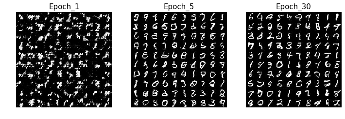
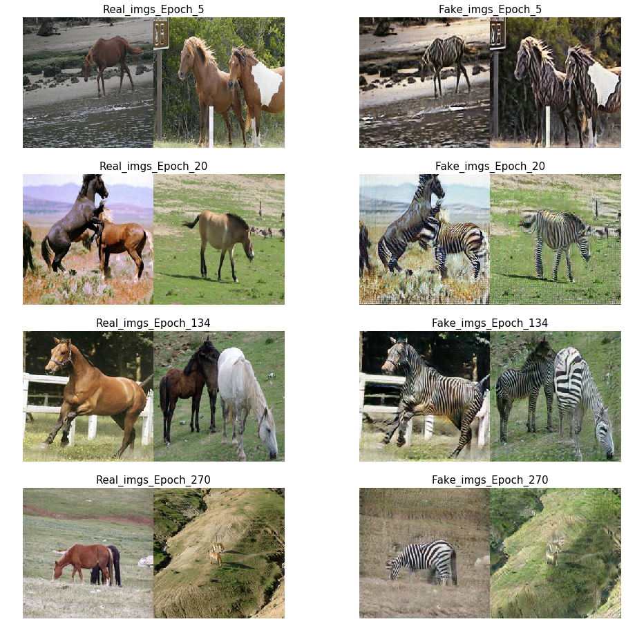

# Generative Adversarial Network
######  Author:   Li yujue 
## DCGAN
[paper link](https://arxiv.org/abs/1511.06434)

An implementation of DCGAN.

DCGAN is a basic GAN structure with noise(a vecter) as an input and it outputs the image that can be seen as the same as real image. I use the `MNIST` dataset to implement this paper.

### Get started
Firstly, you need to run

```
python3 trainDcGan.py
```
The MNIST dataset will be download and be saved at `./data/mnist/`,or you can change the parameter `save_path` which are located at `./params/params.py` to set your own save path.

While training, you can see the samples of the result at `./save/dcGan/`.
There are some results shown as follows



When epoch comes to 5, it can generate the images looked like real digit images. When it comes to 30, the quality of the images generated do not gets improved comparing with the images at epoch 5. Probably, this is because the structure of the `generator` and the `discriminator` is too simple to generate a more realistic image. 

## Cycle GAN
[paper link](https://arxiv.org/pdf/1703.10593.pdf)

An implementation of Cycle GAN.

### Get started
Firstly, you need to run 
``` bash data/download_datasets.sh horse2zebra 
```
to get the `horse2zebra`dataset.
the dataset will be downloaded at `data/horse2zebra`with structure

```
horse2zebra
    ├── testA
    ├── testB
    ├── trainA
    └── trainB
```
To run the model
```
python3 train.py

```

The parameters we need are all set in the `params/params.py`,such like `batch size`,`learing rate`,`dataset path`.

There are some samples generated during the training shown as follows



## Reference
the code referenced [pytorch-CycleGAN-and-pix2pix](https://github.com/junyanz/pytorch-CycleGAN-and-pix2pix).
